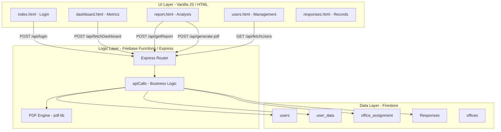

# Architecture

> Auto-generated by /map on 2026-04-08

## Overview

The Feedback System is a comprehensive monitoring and reporting platform designed to collect, analyze, and visualize citizen feedback for various government offices. It uses a serverless architecture based on Firebase, providing real-time data processing and professional reporting capabilities.

## System Map: PAGES → FEATURES → DATA FLOW

| Page | Feature | UI Elements | Data Flow (Trace) | API Endpoint | Firestore Collection |
|------|---------|-------------|-------------------|--------------|---------------------|
| `index.html` | Authentication | Login Form, Username/Password fields | User Input → Bcrypt Hash Check → Session in LocalStorage | `/api/login` | `users`, `user_data`, `office_assignment` |
| `dashboard.html` | KPIs & Dashboards | `myChart` (Bar), `responses` (Bar/Line), Month/Year Dropdowns | Filter Change → Fetch Authored Data → Aggregate Stats → Render Chart.js | `/api/fetchDashboard` | `Responses` |
| `report.html` | Detailed Analysis | Tabbed View (Data, Summary, Graphs), Pagination, PDF Export | Tab Switch → Get Office Report → Transform to HTML Rows → PDF Lib Stream | `/api/getReport`, `/api/generate-pdf` | `Responses` |
| `users.html` | User Administration | User Table, Add User Modal, Office Selector | Load Users → Map Profile Data → Display Table → Sync Assignment | `/api/fetchUsers`, `/api/addUser` | `users`, `user_data`, `office_assignment`, `offices` |
| `responses.html`| Record Management | Data Table (Sortable/Searchable), Edit Modals | Query Responses → Format Dates → Render DataTable → Update Comment Class | `/api/fetchUserData`, `/api/updateComments` | `Responses` |

## Feature Breakdown (User Functions)

### 1. Dashboard Charts & Metrics
- **Overall Feedback Rating (Multi-Series Bar)**: Displays numeric sentiment across `Environment`, `Systems and Procedures`, and `Staff Service`.
- **Gender & Demographic (Bar)**: Categorizes respondents by `Male`, `Female`, `LGBTQ`, and `Others`.
- **Collection vs Logbook (Line)**: Traces the gap between recorded visitors and actual feedback submissions.
- **Citizen's Charter (CC) Awareness (Stacked Bar)**: Measures effectiveness of mandatory information posters.

### 2. Reporting & Exports
- **Consolidated Summary (Table)**: Real-time aggregation of all 30+ offices.
- **PDF Generation**: Generates official formatted reports with headers, logos, and computed indices (Q1-Q9 averages).
- **Sentiment Analysis**: Qualitative categorization into `positive`, `negative`, and `suggestions`.

### 3. Access Control
- **Superadmin**: Full access to all office reports and user management.
- **Office Admin**: Restricted view to inherited offices stored in `office_assignment`.

## Data Flow & Transformations

1. **Aggregation**: Backend calculates `sysrate` (Avg of Q2-Q6) and `staffrate` (Avg of Q7-Q9).
2. **Normalization**: Front-end maps internal keys like `colRate` to display strings like `Collection Rate`.
3. **Chunking**: Firestore queries are batched in groups of 10 to handle large office lists without hitting timeout/payload limits.

## Technical Debt

- [ ] **Modularity**: `call.js` and `report.js` are excessively large (>1.5k lines). Logic should be split into services.
- [ ] **State Management**: Current reliance on `localStorage` for multiple offices string is brittle.
- [ ] **Security**: Sensitive `serviceAccount.json` is located in the `functions/auth/` directory.
- [ ] **Styles**: Inline styles are heavily used in JS-generated elements (`dashboard.js`, `report.js`).
- [ ] **Duplication**: Date formatting logic and month-year constants are redefined across multiple files.

## Conventions
- **Naming**: camelCase for variables, snake_case for some Firestore keys.
- **Structure**: Vanilla JS logic in `public/src/js/` mapping 1:1 to HTML files.
- **API**: Express-on-Cloud-Functions pattern.
