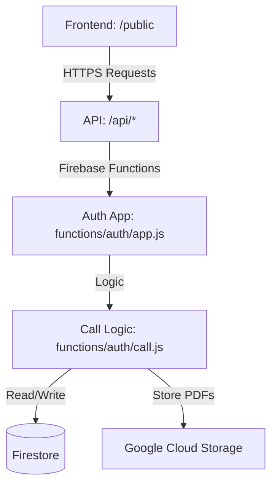

# Architecture

> Auto-generated by /map on 2026-04-06

## Overview

The `feedbackV2` system is a customer feedback management platform built on the Firebase ecosystem. It features a responsive frontend for data visualization (dashboards) and reporting, backed by a Node.js API hosted as a Firebase Cloud Function.

## Components

### Frontend (Hosting)
- **Purpose:** User interface for login, dashboard, user management, and report generation.
- **Location:** `public/`
- **Logic:** `public/src/js/` (Vanilla JS)
- **Styling:** `public/src/css/` (Bootstrap 5, Custom CSS)

### API (Cloud Functions)
- **Purpose:** Server-side logic for authentication, data processing, and PDF generation.
- **Location:** `functions/`
- **Main Entry:** `functions/index.js` (exports the `api` function)
- **Express App:** `functions/auth/app.js` (handles routing for `/api`)
- **Business Logic:** `functions/auth/call.js` (core processing)

### Data Layer (Firestore)
- **Purpose:** Document-oriented database for storing feedback and configuration.
- **Key Collections:**
    - `users`: User credentials and types.
    - `user_data`: Personal information (full name, position).
    - `office_assignment`: Mapping of users to offices they manage.
    - `Responses`: Online feedback records.
    - `offices`: Registry of available offices.

## Data Flow

1. **Authentication:** User submits credentials via `index.html` → `POST /api/login` → `loginUser()` checks Firestore → Returns user object with assigned offices to `localStorage`.
2. **Dashboard Rendering:** `dashboard.html` loads → `init()` fetches aggregated metrics from `POST /api/fetchDashboard` → `functions/auth/call.js` aggregates multi-month/office data → Charts rendered via `Chart.js`.
3. **Reporting:** User triggers PDF generation → `POST /api/generate-pdf` → `pdf-lib` creates PDF from Firestore data → Returned as a stream to the browser.

## Integration Points

| Service | Type | Purpose |
|---------|------|---------|
| Firebase Hosting | Hosting | Serves static assets and provides rewrites to Functions. |
| Firebase Functions | Compute | Hosts the Node.js API for backend processing. |
| Firestore | NoSQL | Primary data storage for users, responses, and settings. |
| GCS | Storage | Used for storing generated PDF assets. |

## Technical Debt

- [ ] **Security:** Service account credentials stored in the codebase (`functions/auth/serviceAccount.json`).
- [ ] **Organization:** `functions/auth/` contains non-auth logic (reports, dashboard fetch). Should be renamed or refactored.
- [ ] **Architecture:** Frontend files are very large (e.g., `dashboard.js` > 1000 lines). Could benefit from modularization or a framework.
- [ ] **Code Hygiene:** Use of `localStorage` for sensitive user data; broad Firestore security rules (`request.auth != null`).

## Conventions

**Naming:** Mostly `camelCase` in JS, variable collection naming in Firestore.
**Structure:** Traditional Firebase setup with public directory as web root.
**Testing:** No automated tests found in the mapping process.
