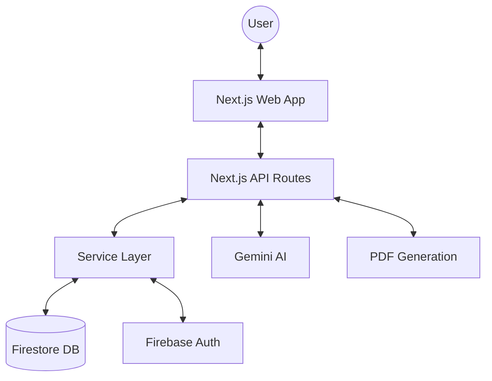

# Architecture

> Auto-generated by /map on 2026-05-04

## Overview

A feedback management platform built with Next.js and Firebase, featuring AI-driven analytics, RBAC, and PDF reporting.

```mermaid
graph TD
    User((User))
    Web[Next.js Web App]
    API[Next.js API Routes]
    Services[Service Layer]
    Firestore[(Firestore DB)]
    Auth[Firebase Auth]
    Gemini[Gemini AI]
    PDF[PDF Generation]

    User <--> Web
    Web <--> API
    API <--> Services
    Services <--> Firestore
    Services <--> Auth
    API <--> Gemini
    API <--> PDF
```

## Components

### Frontend (Next.js App Router)
- **Purpose:** User interface and client-side logic.
- **Location:** `src/app`
- **Sub-components:**
  - `analytics`: AI report generation and viewing.
  - `dashboard`: Main metrics and status overview.
  - `responses`: Feedback listing and classification.
  - `offices`: Office management and assignments.
  - `users`: User management and RBative assignments.

### Service Layer
- **Purpose:** Encapsulated business logic and database abstractions.
- **Location:** `src/lib/services`
- **Key Services:**
  - `userService`: Handles user profiles and assignments.
  - `responseService`: Manages feedback responses and classifications.
  - `officeService`: Handles office metadata and structure.
  - `metricsService`: Computes statistics for dashboard and reports.
  - `physicalReportService`: Manages physical report records.

### API Routes
- **Purpose:** Server-side endpoints for frontend interactions.
- **Location:** `src/app/api`
- **Integrations:** Firebase Admin SDK, Gemini API.

## Data Flow

1. **Authentication:** User logs in via Firebase Auth; session managed by Next.js.
2. **Feedback Ingestion:** Data stored in `Responses` collection in Firestore.
3. **Classification:** AI or manual classification updates `Responses` with categories and sentiment.
4. **Aggregation:** `metricsService` queries Firestore to compute monthly/quarterly statistics.
5. **Reporting:** `reports` API generates PDF summaries using `pdf-lib` and AI insights.

## Integration Points

| Service | Type | Purpose |
|---------|------|---------|
| Firebase | DB/Auth | Core data storage and user management |
| Gemini API | AI | Sentiment analysis and report generation |
| pdf-lib | Library | PDF document construction |

## Technical Debt

- [ ] Consolidate legacy code (`legacy`, `legacyV2`) into `src`.
- [ ] Replace `alert()` calls with modern UI notifications (e.g., Sonner).
- [ ] Implement comprehensive unit tests for `services` layer.
- [ ] Standardize error handling across API routes.

## Conventions

**Naming:** PascalCase for components, camelCase for services and functions.
**Structure:** Feature-based routing in `app`, centralized logic in `lib/services`.
**Testing:** Vitest for unit tests (partially implemented in `integration-tests`).
